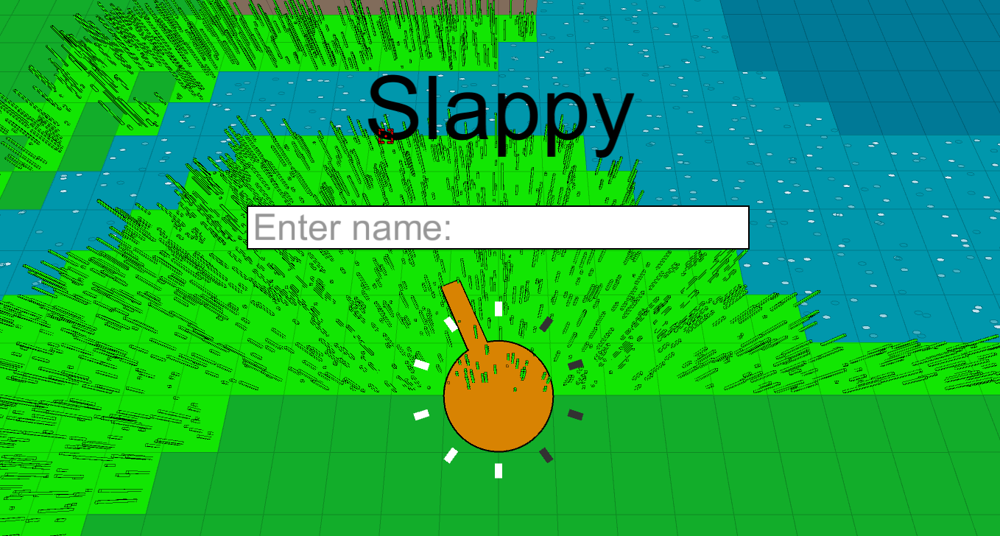
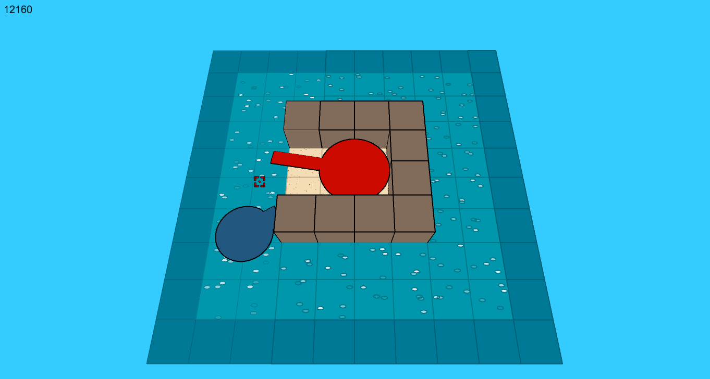
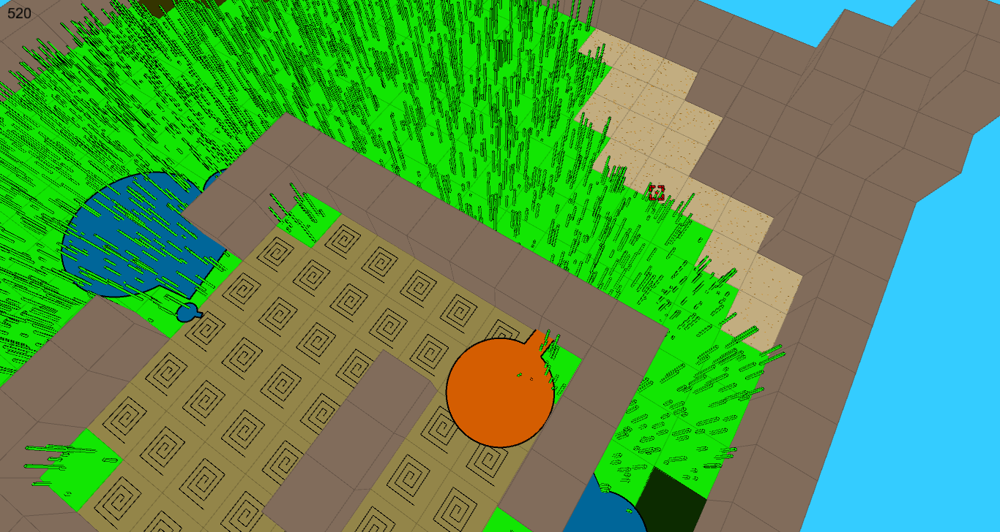
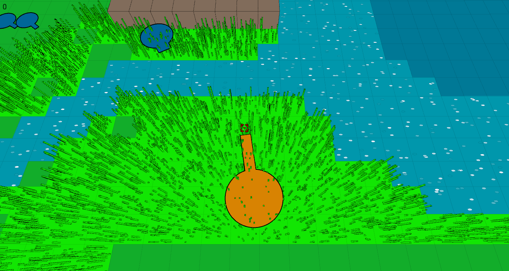
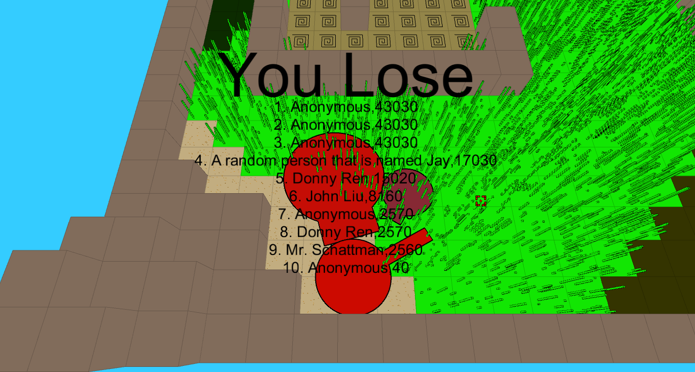

# Slappy_Rebooted
Hi this is Donny and I made this for my grade 12 CS project.

Was fun to make and I hope it's fun to play!

This is the start screen. Enter your name then light up all the rectangles to begin.

WASD to move.

This is the first level.

When you destroy all the enemies you have to go to the portal to advance.

Currently the portal is invisible cuz I didn't have time to add that in. So just wiggle around till you find it.

Q and E to rotate the view, X to toggle offset, and Z to reset the rotation.

As of now, I run a pathfinding algorithm for every enemy every frame. Which is bad. So on the last level you may experience big lag.

If I ever come back to fix this game, the first thing I'll have to do is to do some sort of Quadtree partitioning and Dynamic Pathfinding
to reduce the load.

When the game ends, which is when you die or you've killed everyone, then your name goes on the Leaderboard forever.
And we will sing songs about you for years to come.

JK it's just a local file and nobody cares.

